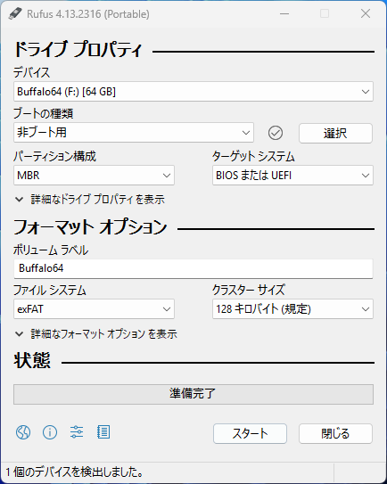
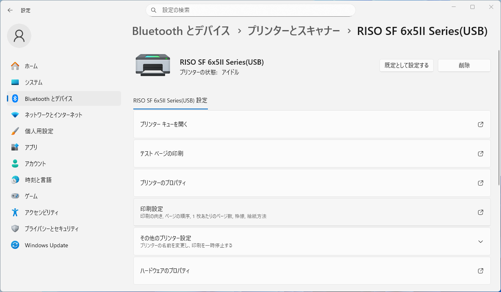

# USBメモリやPCをもとに戻す

::: tip
ここからの手順は、すべての印刷作業が終わった後に、必要に応じて行ってください。
:::

## USBメモリをもとに戻す

[前述の手順](../prepare/usb-setup#fat32へのフォーマット)でUSBメモリはFAT32というやや古い形式にフォーマットしました。  
このままでもUSBメモリは利用できますが、現在の主流であるexFATに戻す方法を紹介します。  
FAT32のままでよい場合は、USBメモリ内のファイル・フォルダをすべて削除すれば、もとに戻すことができます。

### exFATへのフォーマット

USBメモリをPCに接続します。

::: warning
USBメモリの中身はすべて消去されるので、必要なデータが入っていないか確認してください。
また、手順を誤ると、PCの他のドライブを消去してしまう可能性があるので、十分に注意してください。
:::

前の手順でダウンロードフォルダにダウンロードした、`rufus-0.00p.exe`をダブルクリックして、Rufusを起動してください。

Rufusが起動したら、`デバイス`で利用するUSBメモリを選択してください。  
次に、`ブートの選択`から、`非ブート用`を選択してください。  
次に、`ファイルシステム`から、`exFAT`を選択してください。

特に`デバイス`に間違いがないことを確認して、`スタート`をクリックしてください。  
アラートに従い`OK`をクリックして、フォーマットを開始してください。

`状態`表示が再び`準備完了`になったら、`閉じる`をクリックしてRufusを終了してください。

## プリンタを削除する

[前述の手順](../prepare/usb-setup#ドライバーのインストール)で、PCに新たなプリンターとしてリソグラフを追加しました。  
そのままでも問題はありませんが、気になる場合は以下の手順でプリンターを削除することができます。

### プリンタの削除

設定アプリを開き、`Bluetoothとデバイス`の中の`プリンターとスキャナー`を選択してください。

一覧の中から、`RISO SF 6x5ⅡSeries(USB)`か`RISO SD 5x30 Series(USBメモリ)`を選択して、`削除`をクリックしてください。

これで、PCからリソグラフのプリンターが削除されました。

::: info
プリンターを削除しても、ドライバーはPCに残ったままになります。  
PCの利用に一切支障がないためここでは詳しく紹介しませんが、プリンターの設定下の`プリントサーバープロパティ`の`ドライバー`タブから、ドライバーを削除することもできます。
:::
