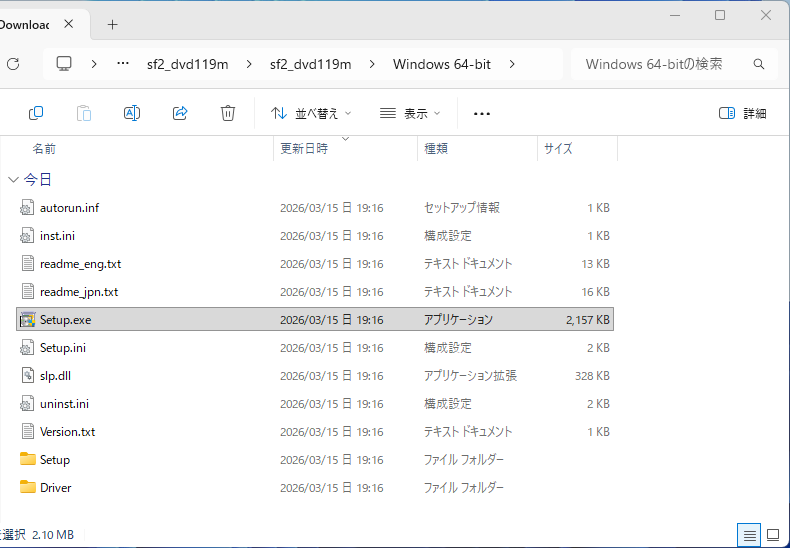
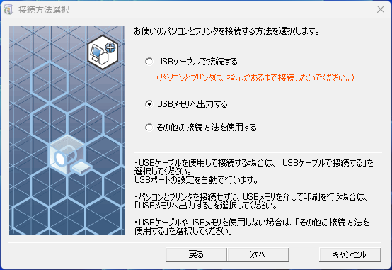
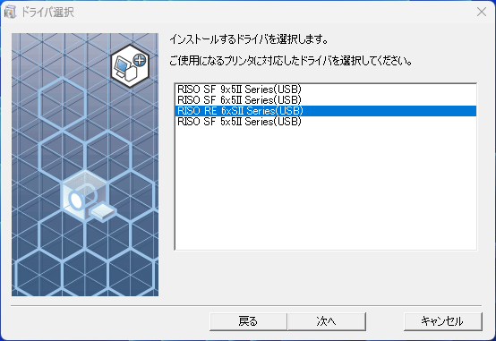
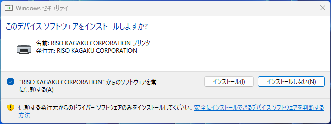
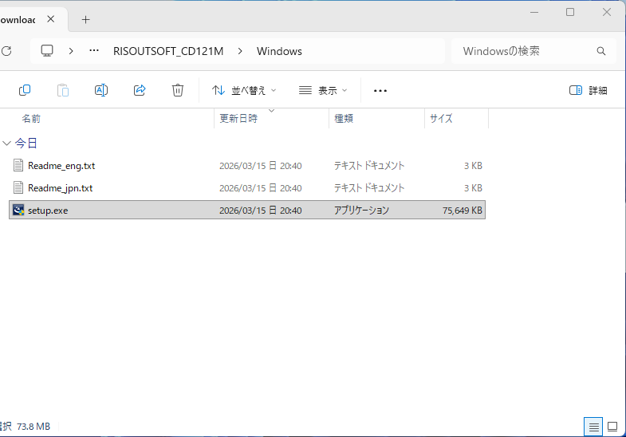

# ドライバ・ツールのインストール

::: tip
ここからの手順は、使いたいPCとUSBメモリで一度だけ行う必要があります。
:::

リソグラフで印刷するために必要なドライバやツールのインストール方法を説明します。

## ドライバー等のダウンロード

PCで、使いたい機種のプリンタードライバーとユーティリティーソフトをダウンロードしてください。  
プリンタードライバーは機種ごとに異なり、ユーティリティーソフトは機種によらず共通です。

### SF625Ⅱ(生徒会室の新しい方)

下記のリンクより、プリンタードライバー`RISO Printer Driver for SF9II/SF6II/SF5II Series`と、ユーティリティーソフト`RISO Utility Software`をダウンロードしてください。

[ダウンロード SF9II/SF6II/SF5II Series](https://www.riso.co.jp/dl/sf2_dvd119m_whql.html)

### SD5430(生徒会室の古い方)

下記のリンクより、プリンタードライバー`RISO PRINTER DRIVER for SD5x30 Series`と、ユーティリティーソフト`RISO Utility Software`をダウンロードしてください。

[ダウンロード SD5x30 Series](https://www.riso.co.jp/dl/sd53_cd108f_win.html)

### その他の機種

使いたいリソグラフの型番が上記にない場合は、[プリンタードライバー・ユーティリティソフト・マニュアルのダウンロード](https://www.riso.co.jp/dl/index.html)からドライバやツールを探すことで、同様にダウンロードできる可能性があります。

## ドライバーのインストール

ダウンロードしたドライバーのZIPファイル(`sf2_dvd119m.zip`か`SD5x30_CD108f.zip`)を、右クリックして「すべて展開」を選択し、解凍してください。

解凍してできたフォルダの中にある(2階層中にある)`Windows 64-bit`フォルダの中にある`Setup.exe`をダブルクリックして、インストーラーを起動してください。

::: info
現在ほとんどのPCが64ビットOSであるため、`Windows 64-bit`と書きましたが、32ビットOSを使用している場合は、`Windows 32-bit`のドライバーをインストールしてください。  
わからなければ、上記の通り`Windows 64-bit`のドライバーをインストールしてみてください。
:::

インストーラーに従って`OK`、`次へ`をクリックして進めます。

`お使いのパソコンとプリンタを接続する方法を選択します。`の画面では、`USBメモリへ出力する`を選択して、`次へ`をクリックしてください。

`インストールするドライバを選択します`の画面では、使いたい機種`RISO SF 6x5ⅡSeries(USB)`か`RISO SD 5x30 Series(USBメモリ)`を選択して、`次へ`をクリックしてください。

`プリンタ名を入力します。`の画面では、デフォルトのまま、`次へ`をクリックしてください。

`プリンタドライバのインストールの準備ができました。`の画面では、`インストール`をクリックしてください。

`このデバイスソフトウェアをインストールしますか?`というアラートが表示されるので、`インストール`をクリックしてください。

完了した旨が表示されたら、`OK`をクリックしてください。
画面に従い、`今すぐに再起動する`を選択してPCを再起動するか、後で自分で再起動してください。

## ユーティリティーソフトのインストール

ダウンロードしたドライバーのZIPファイル(`RISOUTSOFT_CD121M.zip`)を、右クリックして「すべて展開」を選択し、解凍してください。

解凍してできたフォルダの中にある(2階層中にある)`Windows`フォルダの中にある`setup.exe`をダブルクリックして、インストーラーを起動してください。

インストーラーに従って`次へ`をクリックして進めます。

使用許諾契約の条項に同意します。

`セットアップタイプ`の画面では、そのまま`すべて`を選択した状態で、`次へ`をクリックしてください。
::: info
`理想集計アプリケーション`は今回は利用しないため、`カスタムセットアップ`よりインストールを除外しても構いません。
わからない場合は、上記の通り`すべて`を選択してインストールしてください。
:::

`インストール`をクリックして、インストールを開始し、`完了`の画面が表示されたらOKです。

`理想USBメモリマネージャー`と`理想集計アプリケーション`の2つがインストールされていたら成功です。

## Rufusのダウンロード
[次の手順](./usb-setup#fat32へのフォーマット)で利用するRufusというUSBメモリのフォーマットツールを、ダウンロードします。

下記のリンクにアクセスします。  
[Rufus ダウンロード](https://rufus.ie/ja/#download)

Portable版のRufus`rufus-0.00p.exe`をクリックしてダウンロードしてください。  
`0.00`の部分は、ダウンロードする時点での最新バージョンの数字になります。

ダウンロードフォルダに`rufus-0.00p.exe`がダウンロードされていたら成功です。
