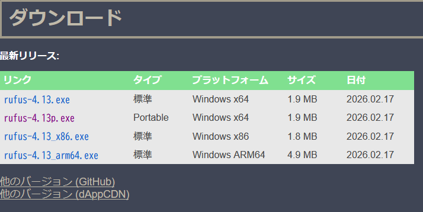

# 関連ツールのインストール

今後の手順で利用するその他のツールをインストールします。  
必須のツールではないため代替手段のある場合はそちらを利用しても構いませんが、以下のツールを利用する方法が最も簡単で確実です。

## Rufusのダウンロード
USBメモリのフォーマットに利用するRufusをダウンロードします。

下記のリンクにアクセスします。  
[Rufus ダウンロード](https://rufus.ie/ja/#download)

Portable版のRufus`rufus-0.00p.exe`をクリックしてダウンロードしてください。  
`0.00`の部分は、ダウンロードする時点での最新バージョンの数字になります。

ダウンロードフォルダに`rufus-0.00p.exe`がダウンロードされていたら成功です。

## CubePDF Pageのインストール

PDFの結合に利用するCubePDF Pageをインストールします。

下記のリンクにアクセスします。  
[CubePDF Page ダウンロード](https://www.cube-soft.jp/cubepdfpage/)

中央の`無料でダウンロードする`をクリックしてダウンロードしてください。

ダウンロードフォルダにある`cubepdf-page-0.0.0-x64.exe`をダブルクリックしてインストーラーを起動します。  
`0.00`の部分は、ダウンロードする時点での最新バージョンの数字になります。

使用許諾契約書に同意の上、`次へ`をクリックしてインストールを進めてください。  
途中で`E STARTアプリ`のインストールについてのチェックボックスが出てきますが、関係のないアプリのため、チェックを外したまま進めることを推奨します。

CubePDF Pageアプリが追加されたら成功です。

## CubePDF Utilityのインストール
PDFの分割・手動並び替えに利用するCubePDF Utilityをインストールします。

下記のリンクにアクセスします。  
[CubePDF Utility ダウンロード](https://www.cube-soft.jp/cubepdfutility/)

中央の`無料でダウンロードする`をクリックしてダウンロードしてください。

ダウンロードフォルダにある`cubepdf-utility-0.0.0-x64.exe`をダブルクリックしてインストーラーを起動します。  
`0.00`の部分は、ダウンロードする時点での最新バージョンの数字になります。

使用許諾契約書に同意の上、`次へ`をクリックしてインストールを進めてください。  
途中で`E STARTアプリ`のインストールについてのチェックボックスが出てきますが、関係のないアプリのため、チェックを外したまま進めることを推奨します。

CubePDF Utilityアプリが追加されたら成功です。
