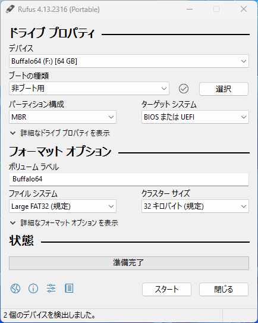

# USBメモリの準備

USBメモリをリセットし、リソグラフで利用できるようにします。

## FAT32へのフォーマット

USBメモリをPCに接続します。

::: warning
USBメモリの中身はすべて消去されるので、必要なデータが入っていないか確認してください。
また、手順を誤ると、PCの他のドライブを消去してしまう可能性があるので、十分に注意してください。
:::

前の手順でダウンロードフォルダにダウンロードした、`rufus-0.00p.exe`をダブルクリックして、Rufusを起動してください。  
初回は`アップデートの自動確認機能`についてのアラートが表示されるので、`いいえ`をクリックしてください。

Rufusが起動したら、`デバイス`で利用するUSBメモリを選択してください。  
次に、`ブートの選択`から、`非ブート用`を選択してください。  
次に、`ファイルシステム`から、`FAT32`もしくは`Large FAT32`を選択してください。

特に`デバイス`に間違いがないことを確認して、`スタート`をクリックしてください。  
アラートに従い`OK`をクリックして、フォーマットを開始してください。

`状態`表示が再び`準備完了`になったら、`閉じる`をクリックしてRufusを終了してください。
