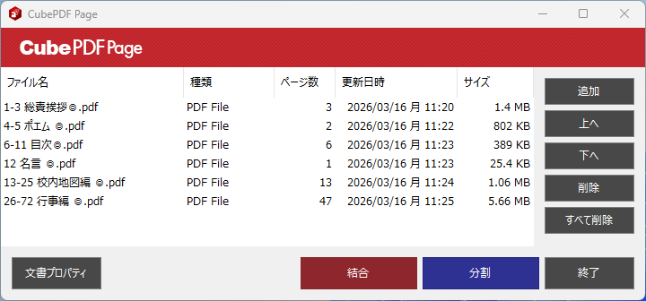
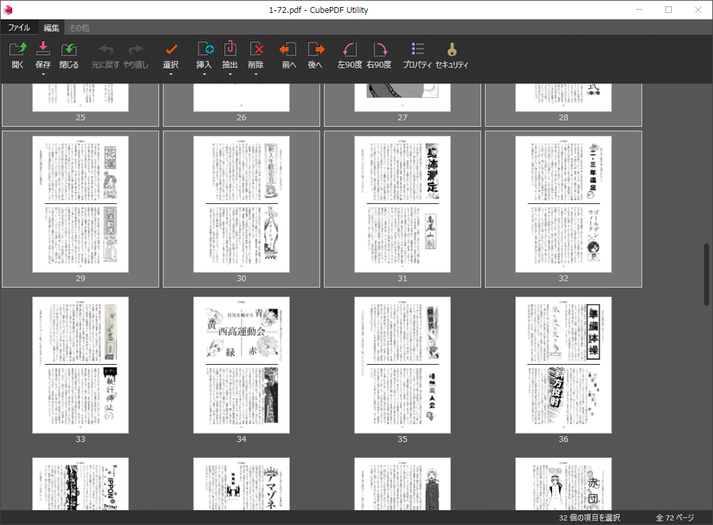

# PDFの結合・分割

::: tip
ここからの手順は、印刷したいPDFファイルごとに行う必要があります。
:::

PDFをリソグラフで印刷する際には、PDFの結合や分割が必要です。  

飛翔のように1面に2ページを印刷し両面印刷をする場合は、PDFのページ数を4の倍数にする必要があります。(後述しますが並び替えも必要なため、2ページのまとまりを2つということはできません。)  

ページ数の多いPDFを印刷しようとすると、1ページ目しかUSBに保存できなかったり、リソグラフでの読み込みに時間がかかったりする場合があります。  
そのため1度に印刷するPDFは16ページ程度(1面に2ページの場合は32ページ程度)に抑える必要があります。

以下で紹介する手順を参考に、PDFを適切なページ数に結合・分割してください。

## PDFの結合

複数のPDFファイルをつなげて1つのPDFファイルに結合するには、CubePDF Pageを利用します。

CubePDF Pageを開きます。

結合したいPDFファイルを順に、アプリへドラッグ&ドロップします。(複数ファイルをまとめてドラッグ&ドロップすることもできます。)  
アプリにはドラッグ&ドロップしたファイル名が一覧で表示され、上から順に結合されることになります。

すべてのPDFファイルをドラッグ&ドロップできたら、`結合`ボタンをクリックします。  
保存ダイアログが表示されるので、結合したPDFファイルの保存先とファイル名を指定して保存します。  
数秒待ち、一覧で表示されていたファイル名が消えたら完了です。

## PDFの分割

多くのページがあるPDFファイルを分けて、いくつかのPDFファイルにするには、CubePDF Utilityを利用します。  
ここでは分割と表現していますが、アプリの機能としては一部ページを抜き出す形になります。

CubePDF Utilityを開きます。

分割したいファイルをアプリへドラッグ&ドロップして、開きます。

表示されているページのうち、まず分割して保存したいページをまとめて選択します。  
Shiftキーを押しながらクリックすることで、複数のページをまとめて選択できます。  
また、選択したい範囲の最初のページをクリックしてから、Shiftキーを押しながら範囲の最後のページをクリックすることで、範囲選択もできます。  
Shiftキーを離した状態でページ外や1つのページをクリックすることで、選択を解除できます。

分割して保存したいページを選択した状態で、上のメニューの`抽出`をクリックします。  
保存ダイアログが表示されるので、結合したPDFファイルの保存先とファイル名を指定して保存します。  
数秒待ったら完了です。

続けて残りのページを選択し、同様の手順で保存をすることで、PDFファイルをいくつかに分割できます。
