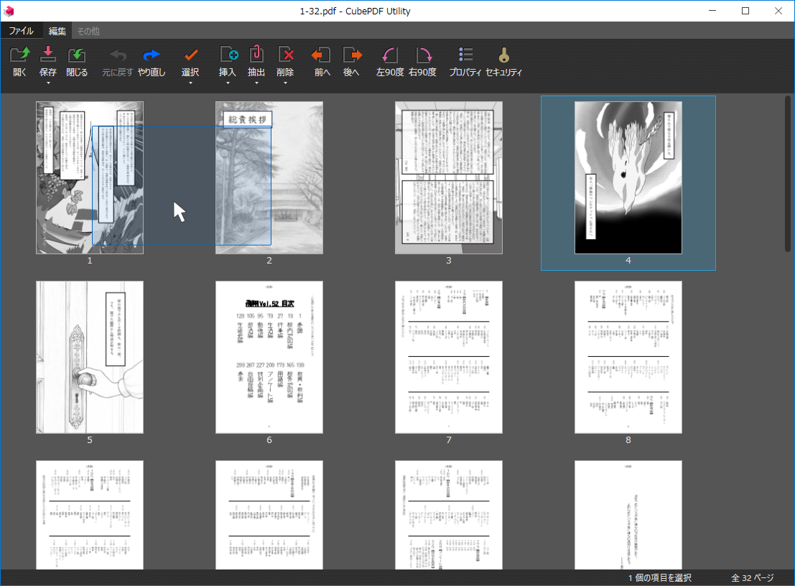

# PDFの並び替え

PDFをリソグラフで印刷する際には、正しく印刷するためにPDF並び替えが必要な場合があります。  
例えば飛翔では、4ページ単位で冊子になるように印刷するため、PDFを並び替えた上で、印刷時に1面に2ページを印刷する設定にします。  
主に飛翔用の自動並び替えツールと、それ以外の並び替えに利用できるツールを紹介します。

## PDF自動並び替えツール

ファイルを選択後、モードをクリックして並び替え・ダウンロードできます。  
並び替えの都合上、ページ数が4の倍数でない場合は自動的に白紙が挿入されます。
<PdfSorter />

## PDFの手動並び替え

PDFのページを手動で並び替えるには、CubePDF Utilityを利用します。  

CubePDF Utilityを開きます。

分割したいファイルをアプリへドラッグ&ドロップして、開きます。

表示されているページをドラッグ&ドロップすることで、ページの順番を入れ替えることができます。

並び替えが完了したら、上のメニューの`保存`をクリックすることで、元々のファイルに上書き保存されます。  
`保存`の下の`▼`より、`名前を付けて保存`をクリックすることで、並び替えたPDFファイルを新しいファイルとして保存することもできます。
