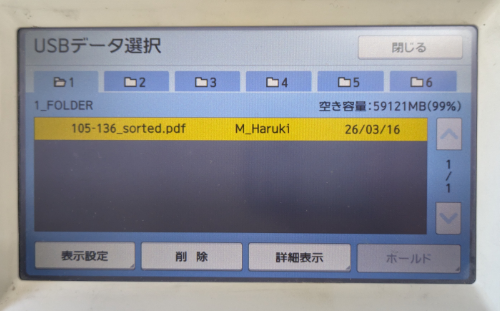
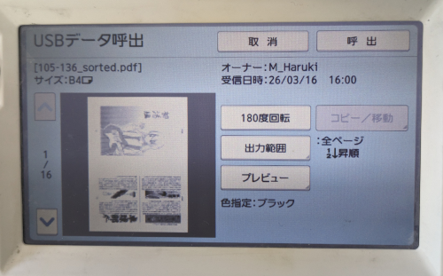
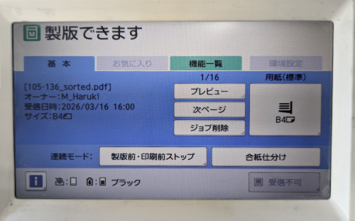
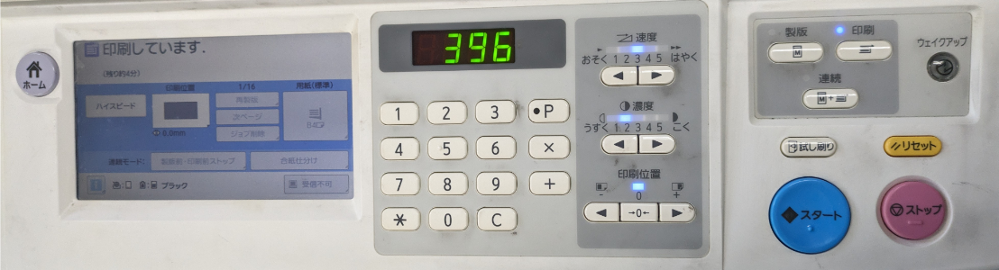

# リソグラフでの製版・印刷

データを保存したUSBメモリを利用して、リソグラフで製版・印刷します。

## 製版・印刷

リソグラフのUSBポートにUSBメモリを挿入してください。  
USBポートは、リソグラフの右側面にあります。

### USBデータ選択

USBメモリを挿すと、リソグラフの画面に保存されたデータの一覧が表示されます。  
印刷したいデータを選択して、`詳細表示`をタップしてください。  
一番上が最後に保存したPDFデータです。

### USBデータ呼出

各ページのプレビューが表示されるので、問題がなければ`呼出`をタップしてください。

### 製版

必要に応じて`プレビュー`より確認をして、スタートボタン(物理ボタン)より製版を開始してください。

### 印刷

物理数字キーより部数を入力して、スタートボタンより印刷を開始してください。

### ページ送り

入力した部数の印刷が終了すると、自動的に次ページに切り替わり、スタートボタンより次のページの製版を続けられます。

`プレビュー`や`再製版`の上に現在のページ番号が表示されます。

一度部数を入力して印刷した後にすぐ追加で印刷をしたい場合は、次のページの製版をせずに印刷ボタン(物理ボタン)を押して印刷をすることで、前のページのデータを印刷できます。

`次ページ`をタップすることで、手動で次のページに切り替えることもできます。

画面操作によって前のページに戻ることはできません。  
前のページに戻りたい場合は、USBメモリを抜き差ししてから、再度やり直してください。

### 終了

一通りの印刷が終わったら、USBメモリを抜いてください。  
[前の手順](./usb-save#usbメモリの確認・データの削除)で紹介した通り、PCの`理想USBメモリマネージャー`アプリを利用して、使い終わったデータを削除することもできます。
