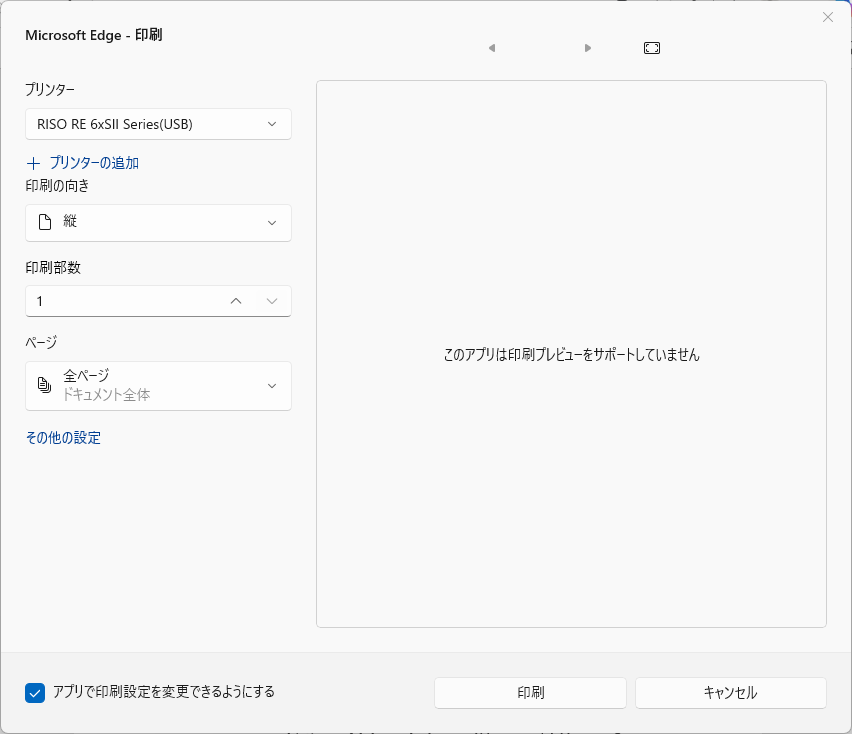
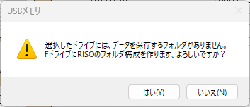
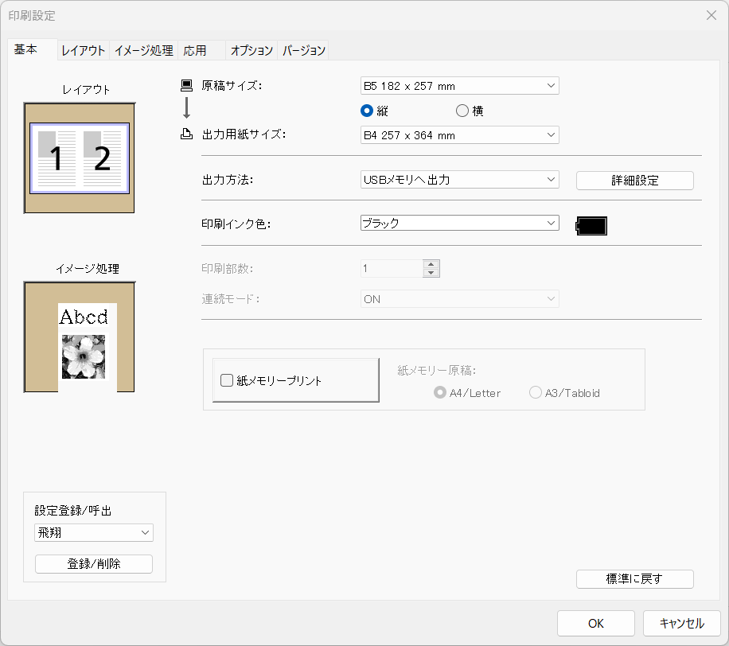
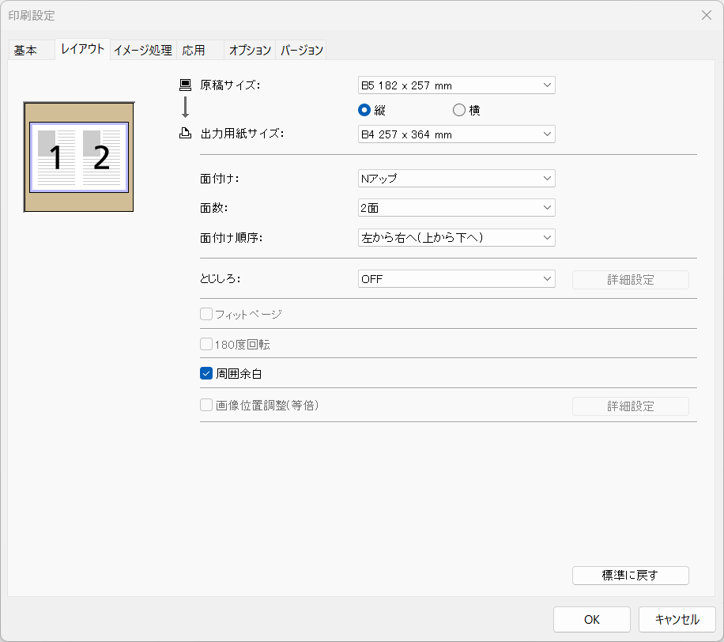
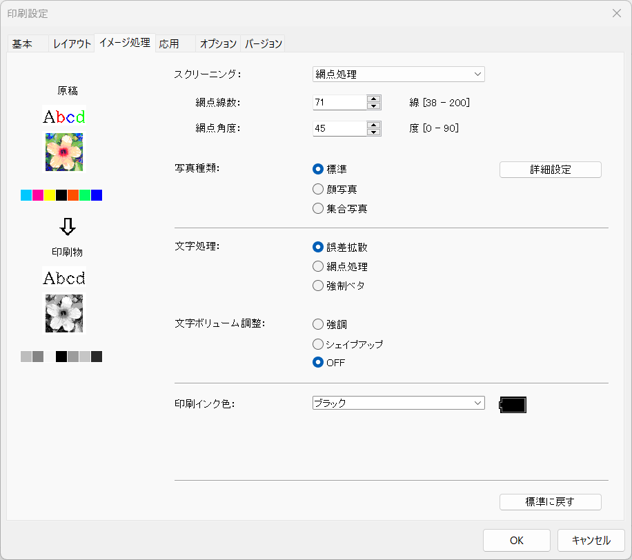
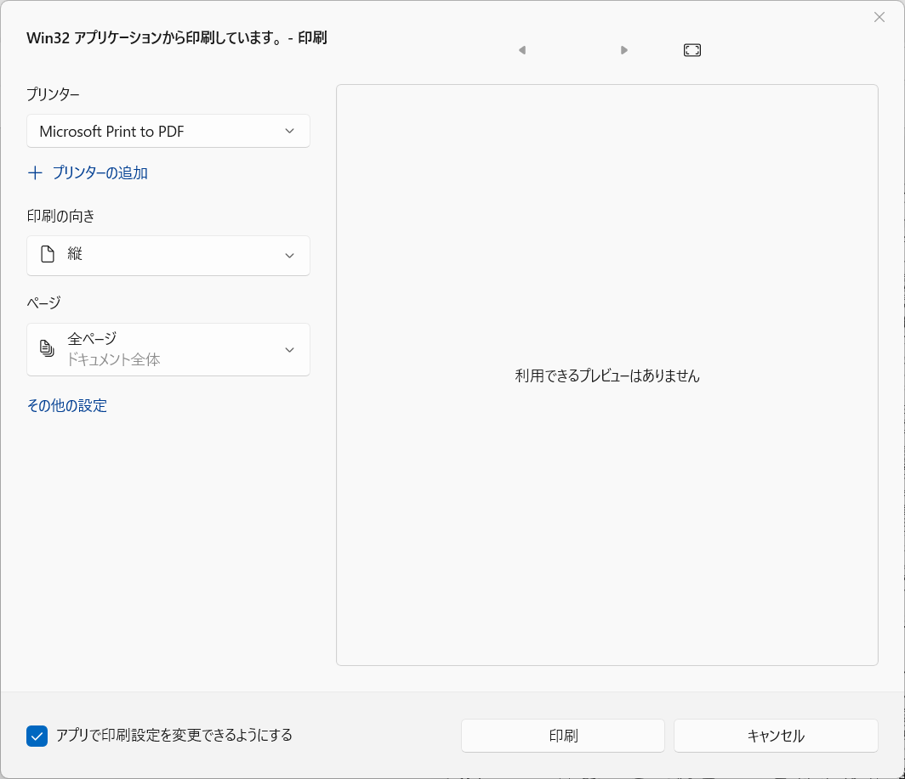
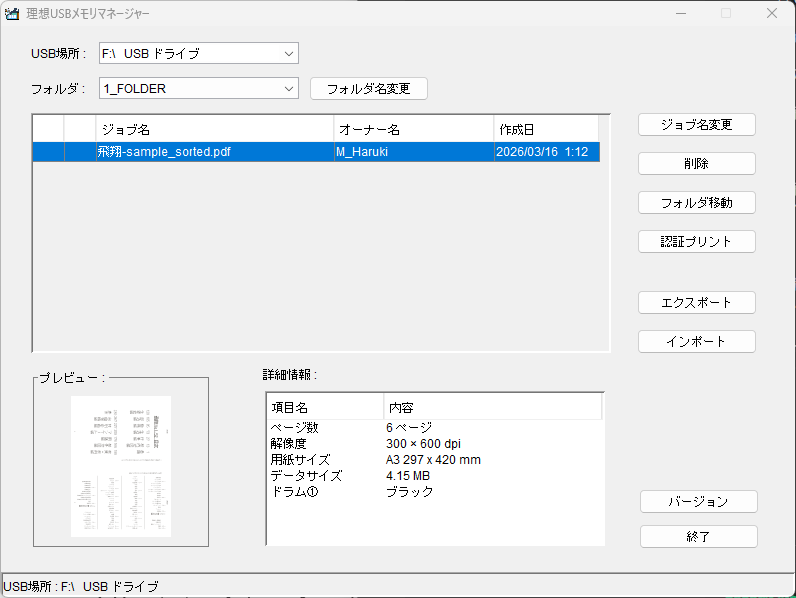

# USBメモリへの保存

並べ替え等ができたPDFを、リソグラフで印刷できる形式に変換してUSBメモリに保存します。

## 印刷ダイアログ

準備したUSBメモリをPCに接続してください。

ブラウザ等でPDFを開き、印刷ダイアログを開いてください。

次の画像とは異なる場合は、`システムダイアログを使用して印刷`を選択して、Windowsの印刷ダイアログを開いてください。

プリンターで`RISO RE 6xSⅡ Series(USB)`か`RISO SD 5x30 Series(USBメモリ)`のどちらか使いたい機種のものを選択してください。

印刷部数は関係ないので、デフォルトのままで大丈夫です。

一部のページだけ印刷したい場合は、必要に応じてページを設定してください。

::: tip
ページ数の多いPDFを印刷しようとすると、1ページ目しかUSBに保存できなかったり、リソグラフでの読み込みに時間がかかったりする場合があります。  
その場合は前の手順のツールなどを利用して、PDFを細かく分割してください。  
1度に印刷するPDFは**16ページ程度**に抑えることをおすすめします。
:::

## 印刷の詳細設定

`その他の設定`をクリックして、印刷の詳細設定を開いてください。

::: tip
この章の参考画像は**飛翔向けの設定例**です。
:::

### USBメモリのアラート
USBメモリを始めて使う場合、次のようなアラートが出ますので、`はい`を選択してください。

### 基本
上のタブから`基本`を選択して、基本の設定を開けます。

原稿サイズや出力用紙サイズ、向き等をを必要に応じて設定してください。

また、設定の登録や呼出も行えます。

### レイアウト

上のタブから`レイアウト`を選択して、レイアウトの設定を開けます。

1枚に複数ページを印刷する場合は、面付けを`Nアップ`に設定し、`面数`と`面付け順序`を必要に応じて設定してください。

### イメージ処理

上のタブから`イメージ処理`を選択して、イメージ処理の設定を開けます。

印刷の仕上がりを確認しながら、適宜設定を調整してください。

黒い部分でインクがにじんでしまう時は、`詳細設定`より明るさを上げると改善する場合があります。

## 印刷

印刷の詳細設定が完了したら、`OK`をクリックして印刷ダイアログに戻り、`印刷`をクリックしてください。  
これで、PDFがリソグラフで印刷できる形式に変換されてUSBメモリに保存されます。

::: info
稀に、USBメモリに保存すると白紙になってしまうページがあります。  
その場合、プリンターで`Microsoft Print to PDF`を選択して印刷してPDFとして保存し直し、そのPDFファイルを使うことで解決できます。

:::

## USBメモリの確認・データの削除

準備でインストールした、`理想USBマネージャー`アプリを利用して、USBメモリに保存されたデータを確認できます。

リソグラフにUSBを挿す前に、追加したデータのページ数などを確認して、ただしく保存されているか確認してください。

使い終わったデータを消したい場合、ジョブ名を選択後、`削除`をクリックします。

